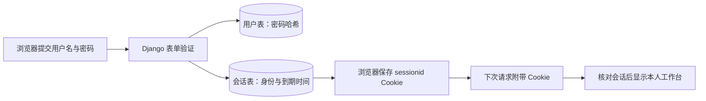

# M1-L02：把登录规范变成计划与小任务

## 本课交付

2026-10-09 依据已确认的登录规范编写 [plan.md](../../specs/001-login/plan.md) 和 [tasks.md](../../specs/001-login/tasks.md)。Git 与文件操作由 Agent 完成，本课只交付文档，登录业务尚未实现。

| 文档 | 你用它做什么 |
|---|---|
| [spec.md](../../specs/001-login/spec.md) | 决定「我做什么，页面应该怎样回应」 |
| plan.md | 理解「现有 Django 怎样实现这些回应」 |
| tasks.md | 指挥「这次只做哪一步，怎样判断完成」 |

需求、方案和任务保存到仓库后，新聊天可以接着做，不需要你重新讲整个项目。

## 一个概念：服务器记住登录，浏览器带上凭证

可以把 Cookie 想成取件号码，会话（session）想成服务器保管的登录记录。你输入密码验证一次，浏览器保存随机号码，后续请求带上号码，Django 找到有效记录就知道你是谁。

按一次实际请求解释：

1. 打开 `/login/`，Django 渲染登录表单，并提供防止伪造提交的 CSRF 令牌。
2. 提交用户名、密码和令牌，Django 验证输入与用户表中的密码哈希。错误就返回表单和提示，保留用户名、清空密码。
3. 成功后 Django 保存会话，截止时间设为「本次登录时间 + 7 天」；浏览器收到 `sessionid` Cookie，再跳到 `/workspace/`。
4. 刷新或新开标签页时，浏览器自动带 Cookie。Django 查询未过期会话，得到 `request.user`，模板显示「你好，当前用户名」。
5. 点击退出，以带 CSRF 的 POST 提交。Django 删除当前会话并清掉 Cookie，回公开首页；旧凭证不能再取得个人页。

密码不会装进会话 Cookie。固定 7 天意味着第 6 天刷新也只剩 1 天，不会重新变成 7 天。两个账号用两个独立浏览器会话验收；同一浏览器的标签页共享登录。

这些行为依据 [Django 会话文档](https://docs.djangoproject.com/en/5.2/topics/http/sessions/)与[认证文档](https://docs.djangoproject.com/en/5.2/topics/auth/default/)，是待实现的数据流，不是当前网站已经具备的功能。

## 为什么先修配置

本地现在没有环境密钥时，每次启动都会生成不同的 `SECRET_KEY`，旧会话会因验证失败失效。先让本地密钥保存在被 Git 忽略的文件中，重启继续使用；线上继续使用已有环境密钥。

浏览器是否保留 Cookie、数据库是否保存会话、服务器是否复用密钥共同决定能否保留登录。只把「7 天」写进配置，不能代替固定截止时间与重启验证。

## 怎样拆成一次能讲清的小块

| 任务 | 完成后能检查什么 |
|---|---|
| T001 稳定配置 | 重启仍使用同一密钥，默认会话策略正确 |
| T002 登录表单 | 空输入和错误凭据提示正确，密码不回填 |
| T003 本地测试账号 | 两个普通账号准备好，凭据留在本机 |
| T004 登录与工作台 | 正确登录、错误处理、未登录跳转、当前身份 |
| T005 会话验证 | 固定到期、重启保留、两个会话独立 |
| T006 退出 | 返回首页，旧登录立即失效 |
| T007 整体验收 | 13 个规范例子、手机操作、本地检查与 CI 准备 |
| T008 PR 交付 | 真实 CI、独立 Agent 审查、合并与发布核对 |

每项在 tasks.md 中都有前置条件、Agent 操作、你的参与与验收证据。通常一次只指定一项；一课可按时间包含几个小块，也可以拆成续课。当前每项都未开始，不把写下任务当作已经完成。

## Git 本课怎样处理

继续在 `feat/001-login` 做文档提交并推送，关联 [Issue #6](https://github.com/zhanag61/studyhub/issues/6)。这里的提交是一个保存点；PR 等整个登录功能实现与验收后再建，后续按规范审查、squash 合并到 main。

本课不合并到 main，不发布新业务。你无需输入终端命令；如果以后想学某条 Git 命令，可以单独让 Agent 解释并安排选学。

## 可选聊天练习

用一句话解释「为什么刷新工作台时不用再次输入密码」。你只要说明浏览器带了什么、服务器据此查了什么，无须背类名或命令。Agent 只有收到你的实际解释后，才会把概念理解记进日志。

如果你希望调整任务，可以发：

> 我希望把 T004 拆为「先验证未登录跳转」和「再完成成功登录」。保持已确认规范，由你更新 plan.md/tasks.md，解释新的前置条件，暂不写代码。

## 检查与下一步

本课验收看计划是否覆盖规范、每项是否可验证、文档链接与 Git 差异是否正确。业务测试、账号创建、浏览器登录验收和部署均未运行。

下一课的**聊天指令**：

> 开始 M1-L03，先只完成 T001。依据规范和技术计划，由你稳定本地密钥、配置会话默认策略并做相关验证，完成提交和课程记录，再解释结果。暂不接入登录页面，不创建账号，不修改线上资源。

不需要为了继续学习先做可选练习。技术方案依据已确认需求编写；若你改变使用行为，先更新规范再实施。
