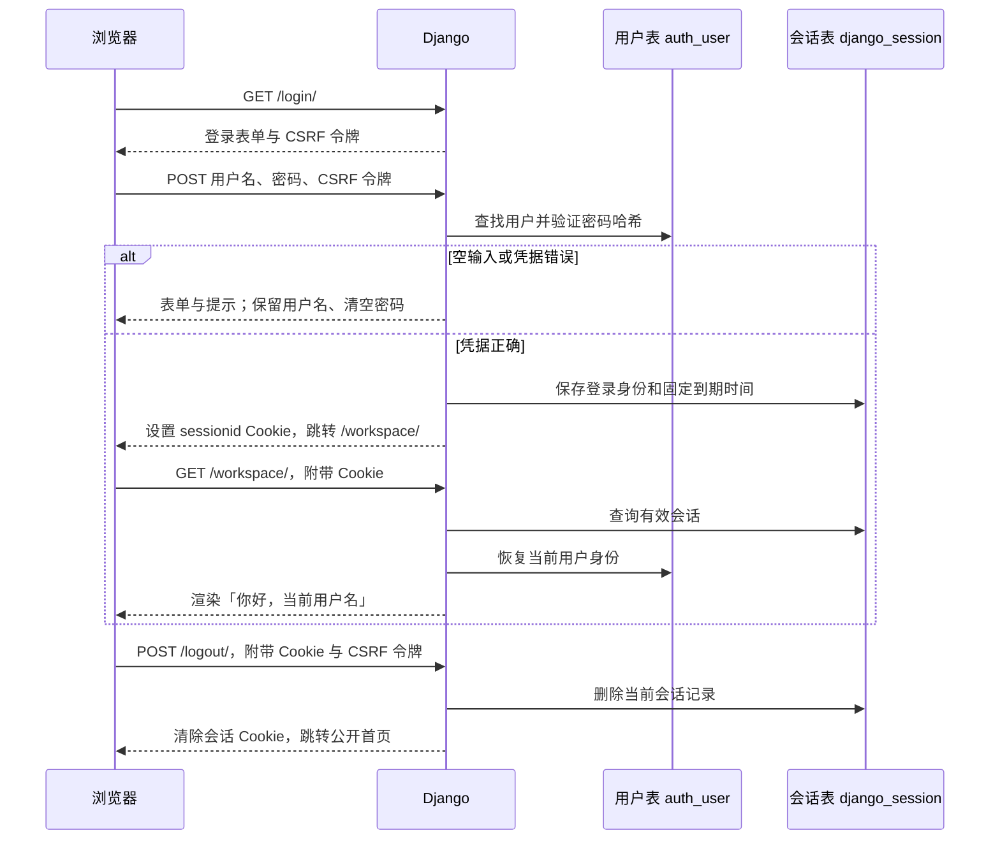

# 001 登录：技术计划

状态：2026-10-09，M1-L02 编写；依据用户已确认的 [spec.md](spec.md)。本文件描述待实现方案，业务代码与验收尚未开始。

关联：[Issue #6](https://github.com/zhanag61/studyhub/issues/6)；功能分支 `feat/001-login`；实施顺序见 [tasks.md](tasks.md)。

## 1. 当前项目与最小方案

本课核对的起点是 `feat/001-login` 的 `7aea27a`，工作区干净。现有 Python 3.13.14、Django 5.2.17、`core` 应用、模板与样式可直接扩展；公开首页和 `/health/` 已存在，登录相关页面、表单、视图和测试尚不存在。

项目已经启用 Django 的认证、数据库会话、CSRF 中间件与模板认证上下文。本地默认 SQLite，线上已配置持久 PostgreSQL 和环境密钥。沿用这些能力，在 `core` 内添加登录、退出与最小工作台，不新增应用、运行依赖、自定义用户模型、密码算法或令牌系统。本轮不需要自定义业务模型或新的业务迁移。

| 已确认行为 | 拟采用的能力 |
|---|---|
| 用户名与密码验证 | Django `AuthenticationForm`、现有用户模型与密码哈希验证 |
| 正确登录、已登录不重复填表 | 扩展 `LoginView`，开启 `redirect_authenticated_user` |
| 未登录不能读取工作台 | `login_required`，身份只读取 `request.user` |
| 登录固定保留 7 天 | 数据库会话；成功登录时设置绝对到期时间 |
| 退出立即结束当前登录 | 扩展 `LogoutView`，使用带 CSRF 的 POST；清除服务器会话 |
| 中文提示、手机使用 | 自有模板继承现有 `base.html`，延续低饱和配色 |

## 2. 数据流：从密码到个人页面

浏览器 Cookie 像取件号码：里面的 `sessionid` 是随机会话标识，实际登录记录保存在服务器数据库中。Cookie 不保存密码；Django 的用户表保存密码哈希，不能把它当作明文密码。会话数据包含用户 ID 等认证信息，经 Django 编码和签名，不把签名称作加密。

后续刷新页面时，浏览器自动带上 Cookie。`SessionMiddleware` 查找未过期记录，`AuthenticationMiddleware` 恢复 `request.user`；工作台检查已登录后才渲染模板。因此无须每次再提交密码，也不能靠更改网址里的用户名冒充别人。正式网站通过已有 HTTPS 配置传输；本机开发使用本机地址。

## 3. 页面与路由合同

| 地址 / 名称 | 方法 | 访问与返回行为 |
|---|---|---|
| `/` / `core:home` | GET | 公开首页；未登录提供登录入口，已登录提供工作台入口 |
| `/login/` / `core:login` | GET、POST | GET 显示表单；有效 POST 登录后进入工作台；已登录 GET 也进入工作台 |
| `/workspace/` / `core:workspace` | GET | 已登录显示当前用户名与功能待开放说明；未登录跳转登录页 |
| `/logout/` / `core:logout` | POST | 校验 CSRF，退出当前会话，回公开首页；GET 不执行退出，返回 405 |
| `/health/` / `core:health` | GET | 沿用现有健康检查，不引入账号查询 |

配置 `LOGIN_URL`、`LOGIN_REDIRECT_URL`、`LOGOUT_REDIRECT_URL` 为上述命名路由。`LoginView` 与 `LogoutView` 都显式覆盖成功目的地，分别固定到工作台与首页，忽略 GET/POST 的 `next` 参数，包括本地地址与外部地址。只配置默认跳转地址仍可能让 Django 优先采用安全的 `next`，不足以满足本轮固定目的地约定。

工作台使用禁止缓存的响应，避免共享缓存保存个人内容；登录和退出保留 Django 自带的禁止缓存处理。退出后其他标签页下一次请求必须重新验证；已经显示的页面不会自动实时消失，不能把这一点误记为旧会话还能读取数据。

## 4. 表单与身份

`core/forms.py` 中的表单继承 `AuthenticationForm`，保留 Django 的验证流程、`request` 参数及密码处理。配置中文标签、必填提示，并将无效凭据提示统一为「用户名或密码不正确」；停用账号也不透露账号状态。密码输入使用不回填值的 `PasswordInput`。

`login.html` 展示字段错误和整体错误，用户名由绑定表单保留，密码不写回 HTML。不添加注册、找回密码或记住我选项。表单使用 CSRF 令牌、明确的 label、用户名/当前密码 autocomplete；需要统一空输入提示时使用服务端表单校验，不只依赖浏览器提示。模板沿用默认自动转义。

`workspace.html` 从 `request.user.get_username()` 显示身份，不接收客户传来的用户 ID 或用户名作为当前身份。最终页面的退出按钮提交 POST 表单并带 CSRF 令牌；在退出路由接入前不放置不能工作的按钮。工作台没有账号列表、计划或任务数据。

## 5. 固定 7 天与重启持久性

### 登录期限

成功验证凭据并调用 Django 登录后，用服务器当前时间加 7 天得到有时区的绝对截止时间，再通过 `request.session.set_expiry(截止时间)` 保存。只在本次成功登录时计算，不在访问工作台、刷新或每次请求时重算。不得仅用 `set_expiry(604800)` 来表达固定截止时间：整数表示从会话修改时起算的相对时长。

明确使用数据库会话后端 `django.contrib.sessions.backends.db`；设置 `SESSION_COOKIE_AGE` 为 7 天、`SESSION_EXPIRE_AT_BROWSER_CLOSE=False`、`SESSION_SAVE_EVERY_REQUEST=False`、`SESSION_COOKIE_HTTPONLY=True`。这些配置表达默认策略，绝对截止时间负责保证本轮登录不因后续浏览或会话写入延长。保留现有生产环境 Secure Cookie 与 HTTPS 设置。

会话数据库的 `expire_date` 和浏览器 Cookie 到期时间对应这次截止时间；即使客户端重放过期 Cookie，数据库后端也不加载已过期记录。用户清除 Cookie 后需要重新登录，不属于期限被提前延长或缩短的实现问题。

退出调用 Django `logout()` 清除当前服务器会话并移除 Cookie，旧 Cookie 即使再次发送也不能恢复身份。保留数据库后端，不能改成仅靠浏览器保存的签名 Cookie 后端来实现这项立即失效要求。不同独立浏览器会话分别保存；不增加跨设备全部退出。

### 本地密钥

现有 DEBUG 模式在没有环境密钥时每次启动随机生成 `SECRET_KEY`，会使旧登录记录验证失败。T001 先修复这项配置，再接入登录：

1. `DJANGO_SECRET_KEY` 仍优先使用；正式模式缺少它仍拒绝启动。
2. 仅本地 DEBUG 回退到项目内已被 Git 忽略的 `.local-secret-key`；首次用 Django 的安全随机生成能力写入，以后读取同一文件。
3. 读写错误或文件无效应明确报配置错误，不能静默换一把新密钥；首次创建不覆盖已有文件，处理并发启动时的创建竞争。
4. 可用 `config/local_secret.py` 隔离读取/创建逻辑，便于用临时目录测试。密钥不打印、不写入课程日志、不提交。

线上保持原来的持久环境密钥与 PostgreSQL，不在此次功能中轮换密钥或改变数据库。重启不会延长会话截止时间；验证需同时保留密钥和数据库。过期会话的定期清理安排在维护阶段，本轮读取时已拒绝过期登录。

## 6. 数据准备与文件范围

已有 Django 用户与会话表足够。实施时先核对本地数据库与内置迁移状态；只在本地需要时执行内置迁移，`makemigrations --check --dry-run` 应报告无需新增迁移。

人工验收使用两个普通、启用的本地测试账号 `learner_a`、`learner_b`，不授予 staff 或超级用户权限。Agent 创建前确认目标是本地 SQLite，不能指向 Neon 或任何正式数据库。通过 Django `create_user()` 创建；若同名账号已存在，先核对归属，不擅自重置其密码。

实际测试密码只保存在本机忽略目录的私有验收资料中，用户在本机查看；不进入文档、终端日志、GitHub 或提交。自动测试使用一次性测试数据库中的专用测试数据，测试用虚构密码与人工账号密码分开。M1-L02 不创建任何账号。

| 待修改或新增文件 | 用途 |
|---|---|
| `config/settings.py`、`config/local_secret.py` | 固定本地密钥、会话默认策略、命名路由配置 |
| `core/forms.py` | 中文登录验证与错误呈现 |
| `core/views.py`、`core/urls.py` | 登录、受保护工作台、POST 退出、固定跳转 |
| `templates/base.html` | 公共导航与登录状态入口 |
| `core/templates/core/login.html`、`workspace.html` | 表单、当前身份与退出按钮 |
| `static/core/styles.css` | 延续现有配色，补充表单、提示与手机布局 |
| `core/tests/` | 配置、表单、HTTP 行为、会话和时间边界测试 |
| `.github/workflows/checks.yml` | 实现测试后加入 SQLite 与临时 PostgreSQL 的登录测试 |
| 规范、课程教材与课程日志 | 按实际证据更新进度；不把设计写成验收结果 |

实施测试组织可按配置、认证、会话分文件；不生成只检查函数内部写法的重复测试。人工账号资料与浏览器临时工具放在已忽略的 `.tools/qa/`。

## 7. 错误处理与验证

| 情况 | 处理 | 证据 |
|---|---|---|
| 必填字段为空 | 字段中文提示，不建立认证身份 | 表单测试、HTTP 提交、浏览器 |
| 密码错、账号不存在或停用 | 同一整体提示，用户名保留，密码清空 | 不同输入的响应与身份断言 |
| 无登录或登录过期 | 工作台跳转登录，不返回个人内容 | 独立 HTTP 客户端与可控时间 |
| 外部或本地 `next` | 登录固定工作台，退出固定首页 | GET/POST 参数测试 |
| POST 无有效 CSRF；GET 退出 | 分别为 403、405；不结束有效登录 | 启用 CSRF 检查的客户端 |
| 退出后重放旧 Cookie | 无法获得个人页面 | 保存旧 Cookie、退出、另发请求 |
| 本地密钥缺失 / 无法使用 | 首次创建；无效或不可读时明确配置失败 | 临时目录中的配置测试 |
| 数据库或正式配置故障 | 不降级成允许个人访问；按已有日志排错，不回显凭据 | 保留既有部署检查，出现故障时专项复现 |

自动测试分批随任务补充：A001–A006、A008、A010、A011 检查 HTTP 行为和身份；A007、A009、A012 检查会话保存、退出与时间边界。固定时间测试覆盖登录时刻 t0、t0+6 天访问后截止时间不变、达到 t0+7 天时被拒绝，以及重新登录获得新的期限，不等待真实一周。

重启验证在 Agent 自己启动的本地临时端口进程进行，保存 Cookie，停止并重启该进程后再次读取工作台；核对仍是原账号且截止时间不变。不停止用户已经运行的 8000 端口进程。关闭重开浏览器与 A013 手机输入、错误提示、工作台及退出另做浏览器验收；模拟视口结果不代替用户实机反馈。

最终检查采用 Django 配置检查、迁移一致性及有业务意义的测试；沿用部署检查。CI 的 PostgreSQL 是任务内临时数据库，不使用真实 Neon 凭据。CI 配置文件存在不代表已通过，PR 实际运行后记录结果。

## 8. 交付与本课边界

M1-L02 只保存本计划、任务、教材与进度，进行文档和 Git 检查。所有应用任务保持未开始；不修改 Python/HTML/CSS、依赖、数据库或线上配置。

下一课从 T001 开始，每项小任务完成后解释改动、核对相关证据并做小提交。M1-L03 推进登录；M1-L04 完成退出、整体验收和 PR，可按每课 60–90 分钟拆成续课。实现与用户验收完成后再创建整个功能的 PR，请另一位 Agent 按规范只读审查，修复后合并并同步 main。

main 合并会触发现有 Render 自动部署；届时核对真实部署结果与公开页面，不能仅以本地通过宣称线上完成。本轮不在生产创建验收账号、不邀请真实用户，多用户正式使用仍在 M4。

## 官方依据

- [Django 5.2 认证视图与表单](https://docs.djangoproject.com/en/5.2/topics/auth/default/)：复用登录、退出、身份验证能力。
- [Django 5.2 会话](https://docs.djangoproject.com/en/5.2/topics/http/sessions/)：数据库会话、绝对到期时间、退出清除。
- [Django 5.2 SECRET_KEY](https://docs.djangoproject.com/en/5.2/ref/settings/#secret-key)：持久密钥与会话验证。

2026-10-09 已核对以上官方文档及本地安装的 Django 5.2.17 相关源码；这是设计依据，不是本功能实现测试结果。
